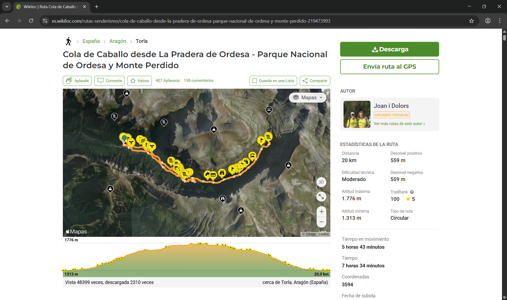
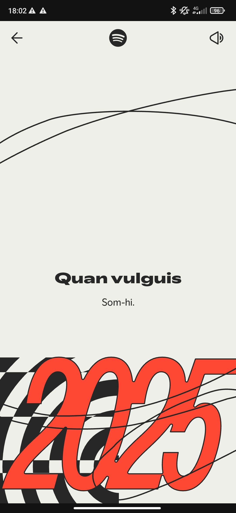
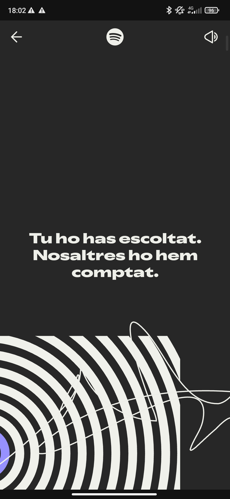
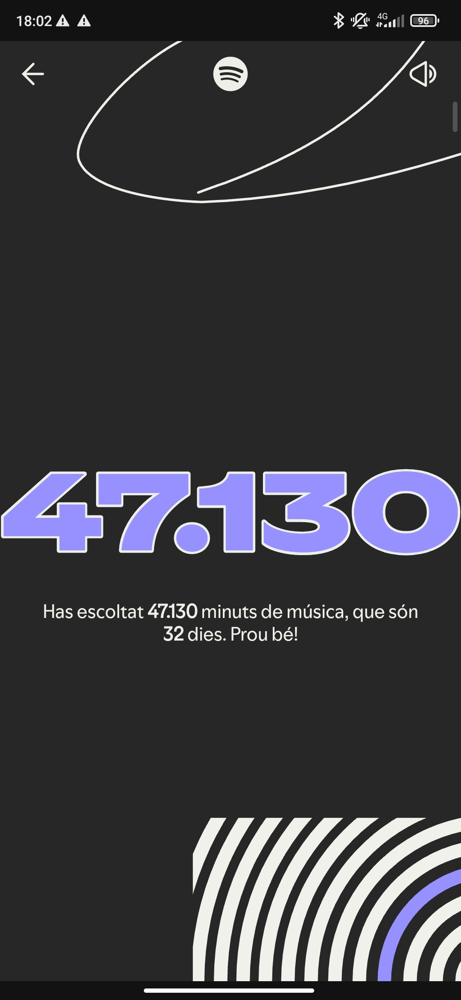
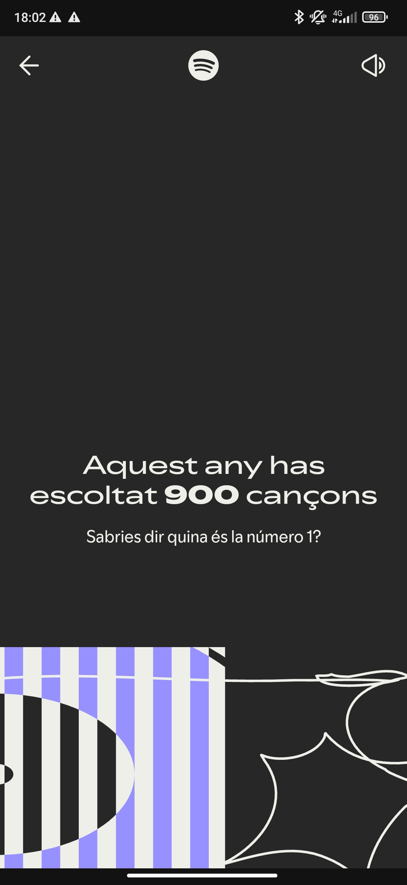

# 📘 PAC3 – Manovich Reloaded

## Introducció

Tal com s’explica al llibre *El software toma el mando* de Lev Manovich, la hibridació és un procés clau dins dels mitjans digitals contemporanis, en el qual la relació entre els diferents elements que conformen un mitjà es veu profundament transformada pel programari. A diferència del multimèdia, on diversos formats com l’àudio, el vídeo o el text conviuen però mantenen una certa autonomia tècnica, en la hibridació aquests elements es fusionen sota una mateixa lògica de software i interfície.

En els mitjans híbrids, les tècniques digitals, els algorismes i les interfícies no només integren diferents llenguatges, sinó que generen una nova experiència cultural coherent, impossible d’obtenir a partir dels elements per separat. El programari esdevé així el veritable medi, capaç de redefinir pràctiques, relats i formes d’interacció.

Aquest document analitza dos casos d’hibridació contemporanis, **Wikiloc** i **Spotify Wrapped**, que exemplifiquen clarament aquesta lògica. Tot i pertànyer a àmbits diferents, ambdós casos mostren com el programari, a través de la gestió de dades i el disseny d’interfícies, crea experiències híbrides que transformen la relació de l’usuari amb el territori, el cos, la música i la identitat digital.

---

## 🧭 ASSAIG 1 — Wikiloc

  

### 1. Descripció del projecte

Wikiloc és una plataforma digital que permet als seus usuaris crear, compartir i consultar rutes vinculades a activitats a l’aire lliure, fomentant una comunitat basada en l’intercanvi d’experiències en el territori. Els usuaris no només generen contingut a partir de les seves pròpies excursions, sinó que també poden valorar i comentar les rutes d’altres participants, aportant informació útil i feedback col·lectiu.

El funcionament de la plataforma es basa principalment en la combinació de cartografia digital i sistemes de geolocalització. Mitjançant l’ús del GPS dels dispositius —principalment telèfons mòbils—, Wikiloc registra els recorreguts realitzats pels usuaris i els transforma en rutes digitals consultables per la resta de la comunitat.

Aquesta plataforma representa una evolució del mapa tradicional, ja que no només ofereix una representació espacial del territori, sinó que incorpora dades tècniques detallades (distància, desnivell, dificultat, temps estimat), contingut visual i valoracions subjectives. D’aquesta manera, Wikiloc converteix l’activitat d’anar d’excursió en una experiència compartida, documentada i mediada pel programari.

### 2. Wikiloc com a mitjà híbrid

Analitzat a través de les “ulleres de Manovich”, Wikiloc pot entendre’s com un clar exemple de mitjà híbrid, ja que integra i fusiona diversos elements sota una mateixa lògica de programari:

- **Territori físic**, on té lloc l’experiència final de l’usuari.  
- **Cartografia digital**, que permet registrar, representar i analitzar les rutes mitjançant GPS.  
- **Activitat esportiva**, que implica el cos com a part activa del sistema.  
- **Base de dades col·laborativa**, construïda a partir de les aportacions dels usuaris.

En aquest sentit, els camins i recorreguts esdevenen objectes de dades, mentre que el cos de l’usuari queda integrat dins del sistema a través del moviment, el registre i la posterior visualització de l’activitat. No es tracta simplement d’afegir tecnologia a una pràctica existent, sinó de reconfigurar-la.

Així, el mitjà digital no substitueix el mapa tradicional, sinó que transforma profundament la manera de relacionar-nos amb el territori, generant una experiència híbrida que combina espai físic, dades i interfície en una única experiència coherent.

### 3. El paper del programari

El funcionament de Wikiloc depèn de manera central del programari, que actua com a mediador entre el territori, la cartografia i l’usuari. Els algorismes de la plataforma permeten organitzar les rutes segons criteris com la ubicació, el tipus d’activitat o el nivell de dificultat, així com generar recomanacions basades en l’historial i les interaccions prèvies de cada usuari.

A més, el programari gestiona les dades obtingudes mitjançant GPS, garantint la coherència i traçabilitat dels recorreguts, i permet la reutilització de les rutes com a mòduls independents dins del sistema. Aquesta lògica modular facilita que un mateix recorregut pugui ser visualitzat, comentat, adaptat o combinat amb altres dades sense perdre la seva estructura bàsica.

Tal com assenyala Manovich, el programari no és només una eina tècnica, sinó un motor cultural que condiciona la manera com es produeixen, s’organitzen i s’experimenten els continguts digitals (Manovich, 2013). En el cas de Wikiloc, és el programari qui defineix les possibilitats d’interacció, representació i significació del territori.

### 4. Base de dades, interfície i experiència

La base de dades de Wikiloc es construeix principalment a partir de les aportacions dels usuaris, que documenten les seves experiències i les integren dins del sistema. Aquesta estructura fa que no existeixi una narrativa fixa: cada usuari pot construir el seu propi recorregut a partir de la selecció, combinació i interpretació de les rutes disponibles.

Un dels aspectes més rellevants de la plataforma és la relació que estableix entre la interfície digital —mòbil o web— i l’experiència física. La navegació per la base de dades no és un fi en si mateixa, sinó que orienta i transforma una acció real en el territori, generant una experiència híbrida entre el món digital i l’espai físic.

### 5. Reflexió crítica personal

Wikiloc ha modificat significativament la manera com ens relacionem amb el territori, aprofitant les possibilitats del programari i les tecnologies de geolocalització. Entre els seus avantatges destaquen la precisió en el seguiment de rutes, la disponibilitat d’informació prèvia per a la presa de decisions i la creació de comunitat mitjançant la compartició d’experiències.

Tanmateix, la plataforma també presenta limitacions, com la dependència de la participació activa dels usuaris per construir la base de dades, el component subjectiu de les valoracions o la necessitat d’actualització constant per mantenir la qualitat del sistema.

Malgrat aquestes limitacions, Wikiloc pot considerar-se un exemple clar de cultura del software aplicada al cos i a l’espai, on el programari reconfigura una pràctica quotidiana i la transforma en una experiència cultural híbrida.

  

---

## 🎧 ASSAIG 2 — Spotify Wrapped

  

### 1. Descripció del projecte

Spotify Wrapped és una funcionalitat integrada dins de la plataforma Spotify que ofereix als usuaris un resum anual personalitzat del seu consum musical. Aquest resum presenta informació com les cançons, artistes, gèneres i podcasts més escoltats al llarg de l’any, així com alguns descobriments destacats, a partir de les dades recollides durant l’ús continuat del servei.

El contingut es mostra mitjançant una presentació visual dinàmica i narrativa, dissenyada per ser fàcilment compartible a les xarxes socials. Aquesta dimensió social fomenta la comparació, la conversa i la construcció de comunitat al voltant dels hàbits musicals, convertint el resum anual en un esdeveniment cultural esperat per molts usuaris al final de cada any.

### 2. Spotify Wrapped com a mitjà híbrid

Analitzat a través de les “ulleres de Manovich”, Spotify Wrapped pot entendre’s com un clar exemple de mitjà híbrid, ja que integra i fusiona diversos elements sota una mateixa lògica de programari:

- **Música**, com a contingut cultural central de la plataforma.  
- **Dades personals**, obtingudes a partir dels hàbits d’escolta de cada usuari.  
- **Disseny gràfic**, que transforma estadístiques en una experiència visual atractiva.  
- **Storytelling**, que estructura les dades dins d’un relat coherent i seqüencial.  
- **Xarxes socials**, que amplifiquen l’experiència mitjançant la compartició i la viralització.

En aquest procés, el consum cultural es tradueix en dades que, posteriorment, són reinterpretades pel programari per construir una experiència personalitzada. L’usuari esdevé el protagonista del relat, però aquest relat és possible gràcies a la mediació del software, que selecciona, ordena i presenta la informació.

### 3. El programari i l’algoritme com a autor

L’algoritme és un element imprescindible en la hibridació que proposa Spotify Wrapped. Aquest ha de ser capaç de seleccionar, classificar i interpretar grans volums de dades per generar un relat que no sigui genèric, sinó aparentment únic per a cada usuari. El resultat no és una representació neutral de les dades, sinó una construcció narrativa orientada a provocar emocions com la sorpresa, la nostàlgia o la curiositat.

En aquest sentit, l’autoria del relat esdevé compartida: l’usuari aporta les dades a través del seu consum musical, mentre que el programari decideix com aquestes dades es transformen en una experiència visual i narrativa concreta. Tal com assenyala Manovich, el programari no només executa instruccions, sinó que crea formes culturals, establint les regles que determinen com s’organitza i es percep el contingut.

Spotify Wrapped exemplifica així com la lògica del programari influeix activament en la cultura musical contemporània, redefinint la relació entre consum, representació i identitat.

### 4. De la base de dades a la narrativa algorítmica

A partir de la base de dades generada per l’ús continuat de la plataforma, Spotify Wrapped construeix una narrativa algorítmica que transforma dades quantitatives en un relat personal. La selecció dels continguts, l’ordre de presentació i el disseny visual contribueixen a crear una experiència que apel·la a la memòria i a les emocions associades a les cançons escoltades.

Tot i que el procés és automatitzat, la narrativa no es percep com a mecànica, ja que es basa en experiències acumulades al llarg de l’any. D’aquesta manera, el relat aparenta explicar l’evolució musical de l’usuari, convertint la base de dades en una història coherent que dona sentit al conjunt de dades.

### 5. Reflexió crítica personal

Spotify Wrapped construeix una identitat digital basada en dades, oferint a l’usuari una experiència personalitzada amb una forta càrrega emocional. Aquesta experiència té un impacte social notable, ja que fomenta la compartició del relat a les xarxes socials i reforça el sentiment de pertinença a una comunitat cultural.

Tanmateix, aquesta personalització té límits. L’algoritme decideix quines dades es destaquen i quines queden invisibilitzades, condicionant el relat final. A més, la representació gràfica i narrativa no pot reflectir la totalitat de la complexitat dels gustos musicals d’un individu.

Malgrat aquestes limitacions, Spotify Wrapped pot considerar-se un exemple clar d’hibridació i un fenomen cultural contemporani que genera expectatives anuals i influeix activament en la manera com es construeix i es comparteix la identitat musical.

  
  

  
  

---

## 🔚 Conclusions generals

Com s’ha vist al llarg d’aquest anàlisi, Wikiloc i Spotify Wrapped constitueixen dos casos clars d’hibridació en la cultura digital contemporània. En ambdós projectes, el programari ocupa un paper central com a mediador entre l’usuari, les dades i l’experiència final, posant en relleu la importància del software com a motor cultural, tal com defensa Lev Manovich.

Tot i compartir aquesta base comuna, els dos casos exemplifiquen formes d’hibridació diferents però complementàries. D’una banda, Wikiloc reconfigura la relació entre cos, territori i cartografia, transformant l’activitat física en una experiència guiada, documentada i compartida mitjançant dades. De l’altra, Spotify Wrapped converteix el consum musical en una narrativa algorítmica personalitzada, on les dades d’ús construeixen una identitat digital amb una forta càrrega emocional i social.

En ambdós casos, la gestió de les dades, el disseny de la interfície i la lògica algorítmica determinen com es presenta i s’experimenta el contingut. Això posa de manifest la vigència del pensament de Manovich, ja que el seu plantejament sobre el programari com a estructura que condiciona les formes culturals resulta plenament aplicable a plataformes actuals que influeixen en la manera com ens relacionem amb l’espai, la cultura i la identitat.

---

## 📚 Referències

### Bibliografia principal
- Manovich, L. (2013). *El software toma el mando*. Barcelona: Editorial UOC.

### Recursos sobre Wikiloc
- Wikiloc. (s.d.). *About Wikiloc*. https://www.wikiloc.com  
- Wikiloc. (s.d.). *How Wikiloc works*. https://www.wikiloc.com/wikiloc/about.do

### Recursos sobre Spotify Wrapped
- Spotify. (s.d.). *Spotify Wrapped*. https://www.spotify.com/wrapped  
- Spotify for the Record. (2023). *What is Spotify Wrapped?*  
  https://newsroom.spotify.com

### Context teòric i divulgatiu
- Manovich, L. (2001). *The Language of New Media*. MIT Press.  
- Xataka. (diversos articles sobre Spotify Wrapped i cultura de dades). https://www.xataka.com

---

## Ús d’eines d’intel·ligència artificial

Per a la realització d’aquest treball s’han utilitzat eines d’intel·ligència artificial de manera puntual i limitada com a suport en diferents fases del procés. Concretament, la IA s’ha emprat per a l’exploració inicial d’idees en l’elecció dels casos d’estudi, la cerca i contrast d’informació general, així com per a la revisió sintàctica, gramatical i estilística del text, amb l’objectiu de donar-li un to més acadèmic i coherent.

En cap cas la intel·ligència artificial ha estat utilitzada per generar de manera automàtica el contingut analític o reflexiu del treball, que ha estat elaborat a partir de l’anàlisi personal de l’autora i de la bibliografia recomanada, especialment l’obra *El software toma el mando* de Lev Manovich.

L’ús de la IA s’ha realitzat, per tant, com una eina de suport comparable a correctors lingüístics o recursos documentals, seguint les recomanacions de la Universitat Oberta de Catalunya sobre l’ús responsable d’aquestes tecnologies.
